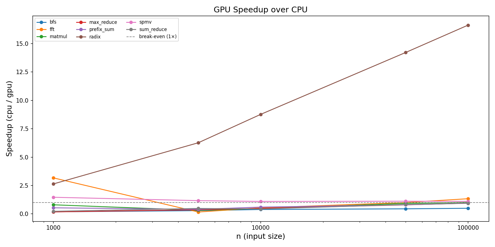

# Pythonic-Algorithms-Lab


Comprehensive laboratory for algorithm implementations, Big-O exploration, and CPU vs GPU benchmarking.

## Repository layout

```
algorithms/
├── cpu/                    # Standard Python / NumPy implementations
│   ├── backtracking/       # N-Queens
│   ├── data_structures/    # Stack, Queue, LinkedList, DoublyLinkedList,
│   │                       # BST, AVL, Trie, SkipList, BloomFilter, MinHeap, UnionFind
│   ├── dynamic_prog/       # Memoized Fibonacci, 0/1 Knapsack
│   ├── geometry/           # Convex hull, Closest pair
│   ├── graphs/             # BFS, DFS, Dijkstra
│   ├── greedy/             # Coin change
│   ├── math/               # GCD, Sieve of Eratosthenes
│   ├── searching/          # Linear, Binary, Jump, Fibonacci search
│   ├── sorting/            # Bubble, Insertion, Selection, Merge, Quick,
│   │                       # Heap, Shell, Counting, Radix, Timsort
│   └── strings/            # KMP, Rabin-Karp, Suffix array
└── gpu/                    # CuPy / Numba CUDA kernels (optional; CPU fallbacks included)
    ├── math/               # Matrix multiply (CuPy)
    ├── sorting/            # GPU sort, parallel sort
    ├── convolution.py      # 1D convolution
    ├── fft.py              # FFT
    ├── numba_kernels.py    # vec_add, matmul (Numba CUDA)
    ├── numba_spmv.py       # Sparse matrix-vector multiply (Numba CUDA)
    ├── radix_cupy.py       # Sort via CuPy
    ├── reduction.py        # Sum / max reduction
    ├── scan.py             # Prefix sum
    └── sparse_ops.py       # SpMV wrapper (Numba → CuPy → CPU fallback)
assets/                     # Static assets (dashboard CSS theme)
benchmarks/                 # CLI benchmark runner, CSV output, interactive Dash app
core/                       # Shared utilities: timer decorator, data generators
docs/                       # Algorithm complexity reference and GPU setup guide
tests/                      # pytest test suite (118 tests)
```

## Supported platforms

- Python 3.14 on Windows / Linux / macOS
- Optional GPU: NVIDIA GPU with CUDA toolkit (targeting CUDA 13.x). All GPU modules include CPU fallbacks.

## Quick start

**1. Install core dependencies**

```powershell
python -m venv .venv
.venv\Scripts\activate
pip install -r requirements.txt
```

**2. Optional: GPU setup (CuPy + Numba)**

Install a CuPy wheel matching your CUDA runtime:
```powershell
pip install cupy-cuda13x
```

For Numba CUDA kernels, `conda`/`mamba` is recommended on Windows to avoid binary compatibility issues:
```bash
conda create -n pyalg python=3.14 -c conda-forge numba cudatoolkit
conda activate pyalg
pip install -r requirements.txt
```

Verify your GPU environment:
```python
import importlib.util
print('cupy present:', importlib.util.find_spec('cupy') is not None)
try:
    import numba
    print('numba version:', numba.__version__)
    print('numba.cuda available:', numba.cuda.is_available())
except Exception as e:
    print('numba:', e)
```

**3. Run tests**

```powershell
python -m pytest -q
```

**4. Run benchmarks**

```powershell
# Single group
python benchmarks/run_benchmarks.py --group sort --sizes 1000 10000 --repeat 3 --out benchmarks/results_sort.csv

# Full sweep
python benchmarks/run_benchmarks.py --full --sizes 100 1000 10000 --repeat 3 --out benchmarks/results_full.csv

# Merge CSVs
python benchmarks/run_benchmarks.py --merge-inputs "benchmarks/results_*.csv" --merge-out benchmarks/results_combined.csv
```

Verify GPU toolchain before GPU-heavy runs:
```powershell
python benchmarks/gpu_smoke.py
```

**5. Interactive dashboard**

```powershell
python benchmarks/dashboard_app.py --csv benchmarks/results_full.csv
```

## Algorithm catalog

| Category | Implementations |
|---|---|
| Sorting | Bubble, Insertion, Selection, Merge, Quick, Heap, Shell, Counting, Radix, Timsort |
| Searching | Linear, Binary, Jump, Fibonacci |
| Graphs | BFS, DFS, Dijkstra |
| Dynamic Programming | Memoized Fibonacci, 0/1 Knapsack |
| Data Structures | Stack, Queue, LinkedList, DoublyLinkedList, BST, AVL, Trie, SkipList, BloomFilter, MinHeap, UnionFind |
| Strings | KMP, Rabin-Karp, Suffix Array |
| Geometry | Convex Hull (monotone chain), Closest Pair |
| Math | GCD (Euclidean), Sieve of Eratosthenes |
| Backtracking | N-Queens |
| Greedy | Coin Change |
| GPU — Sorting | CuPy Sort, Parallel Sort (CuPy w/ CPU fallback), Radix Sort (CuPy) |
| GPU — Math | FFT, Convolution, Vec Add (Numba), Matmul naive + tiled (Numba CUDA shared memory), Matmul (CuPy), Prefix Scan, Sum/Max/Min/Mean Reduce |
| GPU — Sparse | SpMV CSR (Numba CUDA → CuPy → CPU fallback) |
| GPU — Graphs | BFS frontier expansion (CuPy SpMV level-sync → CPU fallback) |

## Documentation

| File | Contents |
|---|---|
| `docs/algorithm-complexity.md` | Big-O time and space reference for all implemented algorithms |
| `docs/gpu-kernels.md` | GPU toolchain installation, verification, best practices |
| `docs/next-iteration-scaffold.md` | Iteration planning scaffold, benchmark protocol, acceptance gates, and report template |
| `benchmarks/README.md` | Benchmark runner usage, CSV workflow, dashboard guide |

## Key findings

Measured on this machine (CPU-only fallback paths where no GPU is available). Run your own sweep to get GPU numbers.

| Algorithm | GPU wins at n ≈ | Peak speedup (n=100k) | Note |
|---|---|---|---|
| Radix sort (CuPy) | 1 000 | **16.6×** | Monotonically improves with n |
| SpMV CSR | 1 000 | **1.1×** | Stable; transfer overhead limits gain |
| FFT | 100 000 | **1.3×** | GPU slower than NumPy below n=50k |
| matmul | 100 000 | **1.0×** | Break-even; tiled kernel needed for dense gains |
| BFS (frontier) | never (at these sizes) | 0.5× | Graph irregularity kills GPU parallelism |
| max/sum reduce | never (at these sizes) | 0.9× | NumPy BLAS baseline is hard to beat |

> FFT anomaly at n=5 000 (0.16× = 6× slower): CuPy warmup + PCIe transfer overhead dominates small arrays.
> Radix is the portfolio headline: sustained superlinear scaling on GPU.

Generate the interactive speedup chart:
```powershell
python benchmarks/dashboard_app.py --csv benchmarks/results_full.csv
# Open http://127.0.0.1:8050 → "CPU vs GPU Speedup" tab
```

Regenerate static plots after a new benchmark run:
```powershell
python benchmarks/plot_results.py --csv benchmarks/results_full.csv --out assets/plots
```



